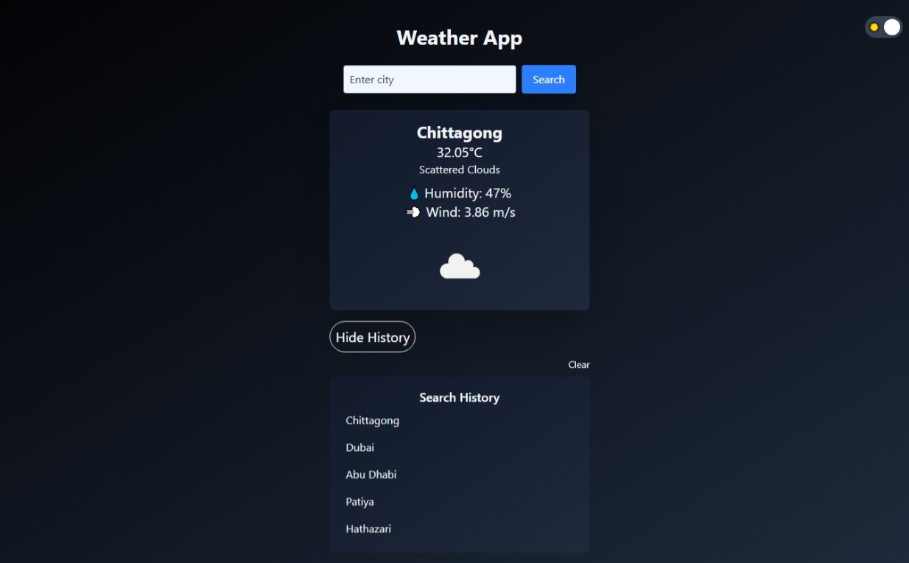
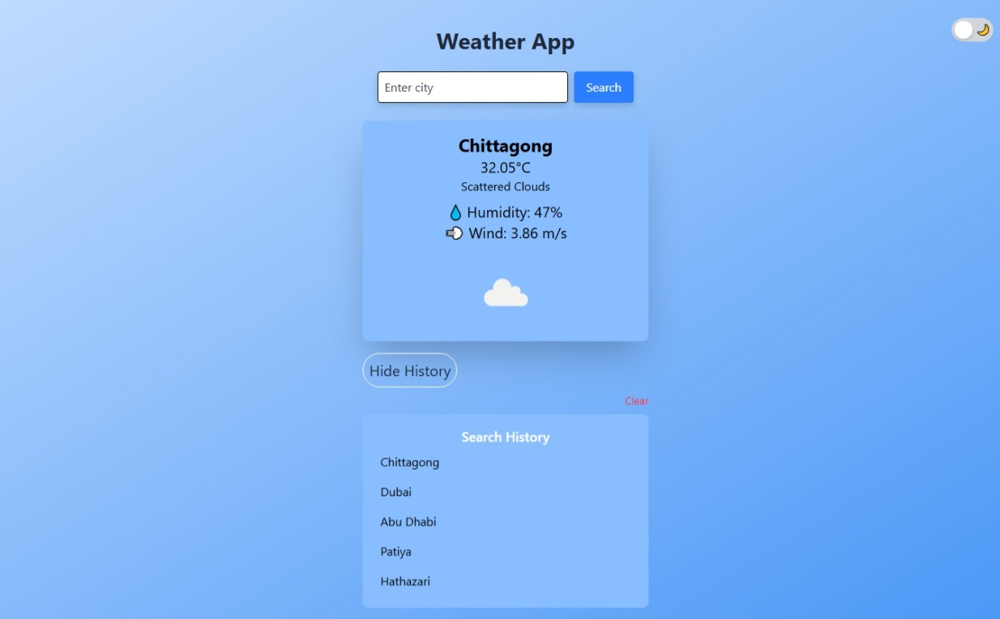

# 🌤️ Weather App

A **responsive weather application** built with **React.js**, **Redux**, **TypeScript**, and **Tailwind CSS**. The app allows users to search for any city and displays current weather information using the **OpenWeatherMap API**. It also supports **light/dark mode**, displays **search history**, and features a smooth user interface.

## Live Preview
[Live Demo](https://my-demo-weather-app.netlify.app/)

### 🌙 Dark Mode



### ☀️ Light Mode


---

## 🚀 Features

* 🌆 City-based weather search
* 🌤️ Current temperature, humidity, and wind speed
* 🌓 Dark & light mode toggle
* 🕓 Search history with clear & hide functionality
* 📱 Fully responsive UI
* 💡 Built using TypeScript and Redux Toolkit

---

## 🛠️ Tech Stack

* **React.js** (Frontend framework)
* **TypeScript** (Type safety)
* **Tailwind CSS** (Styling)
* **Redux Toolkit** (State management)
* **OpenWeatherMap API** (Weather data)

---

## 📦 Installation

1. **Clone the repository:**

   ```bash
   git clone 
   https://github.com/muaz64/Weather-App.git
   cd weather-app
   ```

2. **Install dependencies:**

   ```bash
   npm install
   ```

3. **Create a `.env` file in the root directory and add your API key:**

   ```env
   VITE_OPENWEATHER_API_KEY=your_api_key_here
   ```

4. **Run the app:**

   ```bash
   npm run dev
   ```

---

## 🧠 Folder Structure

```
weather-app/
│
├── src/
│   ├── components/        # Reusable components
│   ├── features/weather/  # Redux slice for weather
│   ├── hooks/             # Custom hooks
│   ├── types/             # TypeScript types/interfaces
│   ├── App.tsx
│   ├── main.tsx
│   └── index.css
│
├── public/
├── .env
├── vite.config.ts
└── README.md
```

---

## 🌐 API Integration

I use **OpenWeatherMap's Current Weather Data API**:

**API Endpoint:**

```
https://api.openweathermap.org/data/2.5/weather?q={city}&units=metric&appid={API_KEY}
```

**Example Call:**

```ts
const response = await fetch(
  `https://api.openweathermap.org/data/2.5/weather?q=Chittagong&units=metric&appid=${API_KEY}`
);
```

---

## 🔍 Key Functionalities

* `WeatherCard.tsx`: Displays city weather info (temp, clouds, humidity, wind).
* `SearchBar.tsx`: Allows user input and dispatches search.
* `DarkModeToggle.tsx`: Switch between dark and light themes.
* `SearchHistory.tsx`: Displays and manages search history.
* `weatherSlice.ts`: Handles API call, state storage via Redux Toolkit.
* `store.ts`: Custom hook for persisting search history.

---

## 📸 UI Highlights

* **Input Box**: Type city name and press search
* **Result Card**: Displays temperature, weather condition, humidity, and wind
* **Dark/Light Toggle**: Toggle switch at top-right
* **Search History**: Listed with hide/clear options

---

## 🧪 Testing

Manual testing can be done through:

* Multiple city searches
* Refresh to verify persisted search history
* Toggle between themes
* Search invalid cities (should handle error states)

---

## 📄 License

MIT License © 2025 \[Muaz Muhammad]
